# LeaderLine

[](https://www.npmjs.com/package/leader-line) [](https://github.com/anseki/leader-line/issues) [](package.json) [](LICENSE)

Draw a leader line in your web page.

**<a href="https://anseki.github.io/leader-line/">Document and Examples https://anseki.github.io/leader-line/</a>**

```html
<div id="start">start</div>
<div id="end">end</div>
```

```js
// Add new leader line from `start` to `end` (HTML/SVG element, basically).
new LeaderLine(
  document.getElementById('start'),
  document.getElementById('end')
);
```

[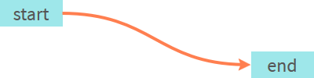](https://anseki.github.io/leader-line/)

It supports options to customize.

[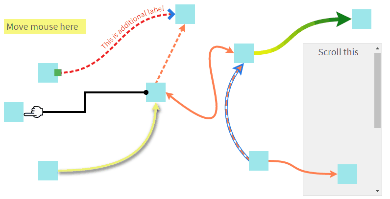](https://anseki.github.io/leader-line/)

Basically, it can indicate HTML/SVG element such as `<div>`, `<button>`, `<ul>`, `<td>`, `<circle>`, `<text>`, etc.

[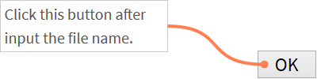](https://anseki.github.io/leader-line/)

It can indicate a part of an element also instead of the element.

[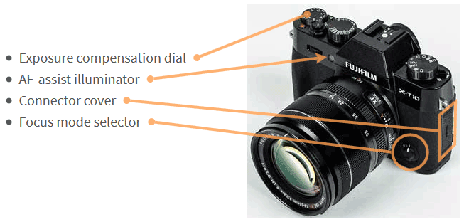](https://anseki.github.io/leader-line/)

[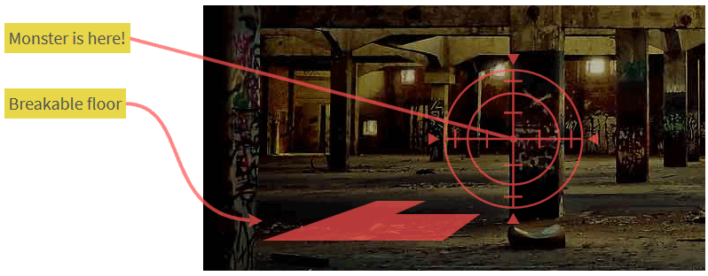](https://anseki.github.io/leader-line/)

Also, it can indicate an element of another library.  
For example, the following uses LeaderLine with [D3.js](https://d3js.org/). Move the mouse on the list.

[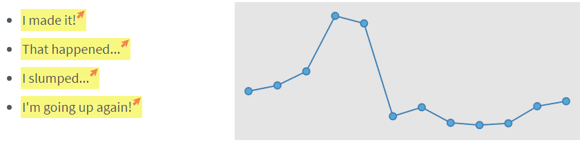](https://anseki.github.io/leader-line/)

## Usage

Load LeaderLine into your web page.

```html
<script src="leader-line.min.js"></script>
```

Pass two HTML/SVG elements to `LeaderLine` constructor. Then a leader line is drawn between those elements.

```js
new LeaderLine(
  document.getElementById('element-1'),
  document.getElementById('element-2')
);
```

[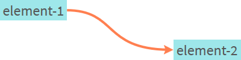](https://anseki.github.io/leader-line/)

Any element that has bounding-box is accepted. For example, `<div>`, `<button>`, `<ul>`, `<td>`, `<circle>`, `<text>`, and also, elements in another window (i.e. `<iframe>`). (See [`start` and `end`](#start-end) option.)

And, the constructor accepts options.

```js
var startElement = document.getElementById('element-1'),
  endElement = document.getElementById('element-2');

// New leader line has red color and size 8.
new LeaderLine(startElement, endElement, {color: 'red', size: 8});
```

[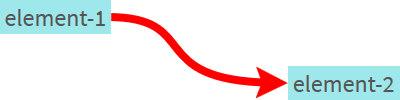](https://anseki.github.io/leader-line/)

Also, the options can be accessed via properties of the instance (readable and writable).

```js
var line = new LeaderLine(startElement, endElement);
line.color = 'red'; // Change the color to red.
line.size++; // Up size.
console.log(line.size); // Output current size.
```

You can change the style of the leader line via [`color`](#options-color), [`size`](#options-size), [`outlineColor`](#outlinecolor), and more [options](#options).

```js
new LeaderLine(startElement, endElement, {
  color: '#fff',
  outline: true,
  endPlugOutline: true,
  endPlugSize: 1.5
});
```

[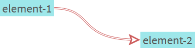](https://anseki.github.io/leader-line/)

You can add effects to the leader line via some options.

```js
new LeaderLine(element1, element2, {
  startPlugColor: '#1a6be0',
  endPlugColor: '#1efdaa',
  gradient: true
});
new LeaderLine(element2, element3, {dash: {animation: true}});
new LeaderLine(element4, element5, {dropShadow: true});
new LeaderLine(element5, element6, {dash: true});
```

[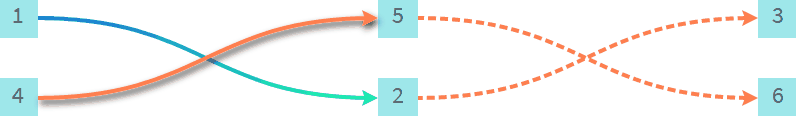](https://anseki.github.io/leader-line/)

You can change symbols that are shown at the end of the leader line via [`startPlug` and `endPlug`](#startplug-endplug) options.

```js
new LeaderLine(startElement, endElement, {
  startPlug: 'square',
  endPlug: 'hand'
});
```

[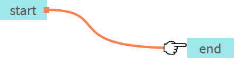](https://anseki.github.io/leader-line/)

You can indicate a point or area of an element instead of the element via [`pointAnchor`](#pointanchor) or [`areaAnchor`](#areaanchor) attachment. You can indicate a point or area of the document also.

You can specify additional labels via [`startLabel`, `middleLabel` and `endLabel`](#startlabel-middlelabel-endlabel) options. Also, [`captionLabel`](#captionlabel) and [`pathLabel`](#pathlabel) attachments can be specified as labels.

```js
new LeaderLine(
  startElement1,
  LeaderLine.pointAnchor(endElement, {
    x: 60,
    y: 20
  }),
  {endLabel: LeaderLine.pathLabel('This is additional label')}
);

new LeaderLine(
  startElement2,
  LeaderLine.areaAnchor(endElement, {
    x: 80,
    y: 60,
    width: 50,
    height: 80,
  }),
  {endLabel: 'This is additional label'}
);
```

[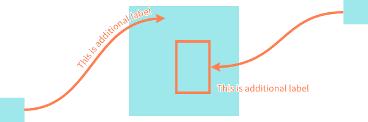](https://anseki.github.io/leader-line/)

You can show and hide the leader line with effects by [`show` and `hide`](#show-hide) methods.  
[`mouseHoverAnchor`](#mousehoveranchor) attachment allows it to implement showing and hiding with mouse moving, easily.

```js
new LeaderLine(LeaderLine.mouseHoverAnchor(startElement), endElement);
```

[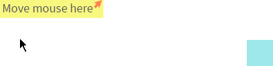](https://anseki.github.io/leader-line/)

For more details, refer to the following.

## Constructor

```js
line = new LeaderLine(options)
```

Or

```js
line = new LeaderLine(start, end[, options])
```

The `options` argument is an Object that can have properties as [options](#options). [`hide`](#hide-option) option also can be contained.

The `start` and `end` arguments are shortcuts to `options.start` and `options.end`. The following two codes work same.

```js
new LeaderLine({start: element1, end: element2});
new LeaderLine({start: element3, end: element4, color: 'red'});
```

```js
new LeaderLine(element1, element2);
new LeaderLine(element3, element4, {color: 'red'});
```

The instance has properties that have the same name as each option to get or set those values (other than [`hide`](#hide-option) option).

```js
var line = new LeaderLine(startElement, endElement);

upButton.addEventListener('click', function() {
  if (line.size < 20) { line.size++; }
}, false);

downButton.addEventListener('click', function() {
  if (line.size > 4) { line.size--; }
}, false);
```

If you want to set multiple options after it was constructed, using [`setOptions`](#setoptions) method instead of the properties may give better performance.

When you will do something about HTML document regardless of the LeaderLine, you typically do that after the HTML document is ready (i.e. the HTML document has been loaded and parsed by web browser).  
For example:

```js
// Wait for HTML document to get ready
window.addEventListener('load', function() { // NOT `DOMContentLoaded`
  // Do something about HTML document
  var line = new LeaderLine(
    document.getElementById('start'),
    document.getElementById('end')
  );
});
```

If you don't wait for HTML document to be ready, you might not be able to get a target element yet, or problems with incomplete layout may occur. Also, you should do so asynchronous like the above for the performance because synchronous code blocks parsing HTML.

### `hide` option

Only the constructor accepts `hide` option. That is, the instance doesn't have `hide` property. (Note that the instance has [`hide`](#show-hide) method.)  
If `true` is specified, the leader line is not shown, it is shown by [`show`](#show-hide) method.  
This is used to hide it without using [`hide`](#show-hide) method, it is not shown at all until `show` method is called.

```js
// The leader line is never shown until the button is clicked.
var line = new LeaderLine(startElement, endElement, {hide: true});
button.addEventListener('click', function() { line.show(); });
```

## Methods

### `setOptions`

```js
self = line.setOptions(options)
```

Set one or more options.  
The `options` argument is an Object that can have properties as [options](#options).

Since this method updates a view only once after it sets all specified options, it may give better performance than setting options via the properties when multiple options are set to the instance that already exists.

### `show`, `hide`

```js
self = line.show([showEffectName[, animOptions]])
```

```js
self = line.hide([showEffectName[, animOptions]])
```

Show or hide the leader line.

```js
var line = new LeaderLine(startElement, endElement, {hide: true});
showButton.addEventListener('click', function() { line.show(); }, false);
hideButton.addEventListener('click', function() { line.hide(); }, false);
```

#### <a name="methods-show-hide-showeffectname"></a>`showEffectName`

*Type:* string  
*Default:* Value that was specified last time, or `fade` at first time

One of the following keywords as effect:

- `none`
- `fade`  
Default `animOptions`: `{duration: 300, timing: 'linear'}`
- `draw`  
Default `animOptions`: `{duration: 500, timing: [0.58, 0, 0.42, 1]}`

#### <a name="methods-show-hide-animoptions"></a>`animOptions`

*Type:* Object  
*Default:* See above

An Object that can have properties as [Animation Options](#animation-options).

### `position`

```js
self = line.position()
```

Re-position the leader line with current position and size of the elements as [`start` or `end`](#start-end) option.  
By default, the position of each leader line is fixed automatically when the window that loads LeaderLine was resized. You should call `position` method if your web page moved or resized the elements without resizing the window. For example, animation, a box that was scrolled or `<iframe>` that was resized.

```js
scrollableBox.addEventListener('scroll', AnimEvent.add(function() {
  line.position();
}), false);
```

(The code above uses [AnimEvent](https://github.com/anseki/anim-event) for a better performance.)

If you want to disable the fixing the position automatically, set `LeaderLine.positionByWindowResize` to `false`.

### `remove`

```js
line.remove()
```

Remove the leader line from the web page. It can't be used anymore.

## Options

The following options are specified by [constructor](#constructor) or [`setOptions`](#setoptions) method. And also, those are accessed via each property of instance.

### `start`, `end`

*Type:* HTML/SVG element or [Attachment](#attachments)

The leader line is drawn from the `start` element to the `end` element.

```js
line.end = document.getElementById('end-element');
```

Any element that has bounding-box is accepted. For example, `<div>`, `<button>`, `<ul>`, `<td>`, `<circle>`, `<text>`, and also, elements in another window (i.e. `<iframe>`).

Note: if you want to handle elements in another window regardless of LeaderLine, you should understand about security.

Or you can specify an [attachment](#attachments) instead of HTML/SVG element to indicate something.

### <a name="options-color"></a>`color`

*Type:* string  
*Default:* `'coral'`

A color (see [Color Value](#color-value)) of the leader line.

```js
line.color = 'rgba(30, 130, 250, 0.5)';
```

### <a name="options-size"></a>`size`

*Type:* number  
*Default:* `4`

The width of the leader line, in pixels.

```js
line.size = 20;
```

### `path`

*Type:* string  
*Default:* `'fluid'`

One of the following keywords to indicate how to draw the line:

- `straight`
- `arc`
- `fluid`
- `magnet`
- `grid`

[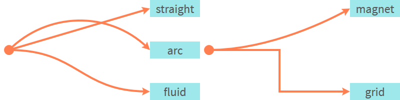](https://anseki.github.io/leader-line/)

### `startSocket`, `endSocket`

*Type:* string  
*Default:* `'auto'`

The string to indicate which side of the element the leader line connects. It can be `'top'`, `'right'`, `'bottom'`, `'left'` or `'auto'`.

```js
line.setOptions({startSocket: 'bottom', endSocket: 'top'});
```

If `'auto'` (default) is specified, the closest side is chosen automatically.

### `startSocketGravity`, `endSocketGravity`

*Type:* number, Array or string  
*Default:* `'auto'`

The force of gravity at a socket.

If a number is specified, the leader line is pulled in the direction of the socket. The number is pull strength.

```js
line.startSocketGravity = 400;
```

If an Array that is coordinates `[x, y]` is specified, the leader line is pulled in the direction of the coordinates. The distance between the coordinates and `[0, 0]` is pull strength.  
For example, if `[50, -100]` is specified, it is pulled in the direction of the rightward and upward (The strength in the Y axis direction is larger than the X axis direction). If `[-50, 0]` is specified, it is pulled in the direction of the leftward (no strength in the Y axis direction).

For example, parabola:

```js
line.setOptions({
  startSocketGravity: [192, -172],
  endSocketGravity: [-192, -172]
});
```

If `'auto'` (default) is specified, it is adjusted to gravity suitable for current [`path`](#path) option automatically.

### `startPlug`, `endPlug`

*Type:* string  
*Default:* `startPlug`: `'behind'` | `endPlug`: `'arrow1'`

One of the following keywords to indicate type of plug (symbol that is shown at the end of the leader line):

- `disc`  
`outlineMax`: `4`
- `square`  
`outlineMax`: `4`
- `arrow1`  
`outlineMax`: `1.5`
- `arrow2`  
`outlineMax`: `1.75`
- `arrow3`  
`outlineMax`: `2.5`
- `hand`  
[`startPlugOutline`/`endPlugOutline`](#startplugoutline-endplugoutline) option is ignored  
[`startPlugColor`/`endPlugColor`](#startplugcolor-endplugcolor) option is ignored
- `crosshair`  
[`startPlugOutline`/`endPlugOutline`](#startplugoutline-endplugoutline) option is ignored
- `behind`  
[`startPlugOutline`/`endPlugOutline`](#startplugoutline-endplugoutline) option is ignored  
[`startPlugColor`/`endPlugColor`](#startplugcolor-endplugcolor) option is ignored

[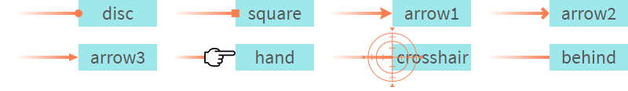](https://anseki.github.io/leader-line/)

### `startPlugColor`, `endPlugColor`

*Type:* string  
*Default:* `'auto'`

Each option for when a plug that accepts this option is specified for [`startPlug`/`endPlug`](#startplug-endplug) option.

A color (see [Color Value](#color-value)) of a plug.  
It is painted separately from the line (i.e. Those don't overlap each other). Therefore one of [`color`](#options-color) and `startPlugColor`/`endPlugColor` or both options can have an alpha channel.

```js
lineA.setOptions({ // element-1, element-2
  color: 'rgba(30, 130, 250, 0.5)', // translucent
  startPlugColor: 'rgb(241, 76, 129)',
  endPlugColor: 'rgba(241, 76, 129, 0.5)' // translucent
});

lineB.setOptions({ // element-3, element-4
  color: 'rgb(30, 130, 250)',
  startPlugColor: 'rgb(241, 76, 129)',
  endPlugColor: 'rgba(241, 76, 129, 0.5)' // translucent
});
```

If `'auto'` (default) is specified, a value of `color` option is set synchronously (i.e. it is changed when `color` was changed).

### `startPlugSize`, `endPlugSize`

*Type:* number  
*Default:* `1`

Each option for when a value other than `behind` is specified for [`startPlug`/`endPlug`](#startplug-endplug) option.

A multiplying factor of the size of a plug.  
The plugs are resized synchronously, with the following options that contain [`size`](#options-size):

Plug Size: `size` * [default-plug-scale] * [`startPlugSize` or `endPlugSize`]

```js
new LeaderLine(element1, element2, {
  startPlug: 'arrow1',
  size: 4,
  startPlugSize: 1,
  endPlugSize: 2
});

new LeaderLine(element3, element4, {
  startPlug: 'arrow1',
  size: 8,
  startPlugSize: 1,
  endPlugSize: 2
});
```

### `outline`

*Type:* boolean  
*Default:* `false`

If `true` is specified, an outline of the leader line is enabled.

```js
line.outline = true;
```

### `outlineColor`

*Type:* string  
*Default:* `'indianred'`

An option for when `true` is specified for [`outline`](#outline) option.

A color (see [Color Value](#color-value)) of an outline of the leader line.  
It is painted separately from inside of the line (i.e. Those don't overlap each other). Therefore one of [`color`](#options-color) and `outlineColor` or both options can have an alpha channel.

```js
lineA.setOptions({ // element-1, element-2
  color: 'rgb(248, 205, 30)',
  outlineColor: 'rgb(30, 130, 250)'
});

lineB.setOptions({ // element-3, element-4
  color: 'rgba(248, 205, 30, 0.5)', // translucent
  outlineColor: 'rgba(30, 130, 250, 0.5)' // translucent
});

lineC.setOptions({ // element-5, element-6
  color: 'rgba(248, 205, 30, 0.5)', // translucent
  outlineColor: 'rgb(30, 130, 250)'
});

lineD.setOptions({ // element-7, element-8
  color: 'rgb(248, 205, 30)',
  outlineColor: 'rgba(30, 130, 250, 0.5)' // translucent
});
```

### `outlineSize`

*Type:* number  
*Default:* `0.25`

An option for when `true` is specified for [`outline`](#outline) option.

A multiplying factor of the size of an outline of the leader line, it is greater than `0` and is less than or equal to `0.48`.  
The outline is resized synchronously, with the following options that contain [`size`](#options-size):

Outline Size: `size` * `outlineSize`

```js
lineA.setOptions({ // element-1, element-2
  size: 12,
  outlineSize: 0.4
});

lineB.setOptions({ // element-3, element-4
  size: 24,
  outlineSize: 0.08
});
```

### `startPlugOutline`, `endPlugOutline`

*Type:* boolean  
*Default:* `false`

Each option for when a plug that accepts this option is specified for [`startPlug`/`endPlug`](#startplug-endplug) option.

If `true` is specified, an outline of the plug is enabled.

```js
line.endPlugOutline = true;
```

### `startPlugOutlineColor`, `endPlugOutlineColor`

*Type:* string  
*Default:* `'auto'`

Each option for when `true` is specified for [`startPlugOutline`/`endPlugOutline`](#startplugoutline-endplugoutline) option.

A color (see [Color Value](#color-value)) of an outline of the plug.  
It is painted separately from inside of the plug (i.e. Those don't overlap each other). Therefore one of [`startPlugColor`/`endPlugColor`](#startplugcolor-endplugcolor) and `startPlugOutlineColor`/`endPlugOutlineColor` or both options can have an alpha channel.

```js
lineA.setOptions({ // element-1, element-2
  startPlugColor: 'rgb(248, 205, 30)',
  startPlugOutlineColor: 'rgb(30, 130, 250)',
  endPlugColor: 'rgba(248, 205, 30, 0.5)', // translucent
  endPlugOutlineColor: 'rgb(30, 130, 250)'
});

lineB.setOptions({ // element-3, element-4
  startPlugColor: 'rgb(248, 205, 30)',
  startPlugOutlineColor: 'rgba(30, 130, 250, 0.5)', // translucent
  endPlugColor: 'rgba(248, 205, 30, 0.5)', // translucent
  endPlugOutlineColor: 'rgba(30, 130, 250, 0.5)' // translucent
});
```

If `'auto'` (default) is specified, a value of [`outlineColor`](#outlinecolor) option is set synchronously (i.e. it is changed when `outlineColor` was changed).

### `startPlugOutlineSize`, `endPlugOutlineSize`

*Type:* number  
*Default:* `1`

Each option for when `true` is specified for [`startPlugOutline`/`endPlugOutline`](#startplugoutline-endplugoutline) option.

A multiplying factor of the size of an outline of the plug, it is greater than or equal to `1` and is less than or equal to `outlineMax` that is shown in [`startPlug`/`endPlug`](#startplug-endplug) option.  
The outline is resized synchronously, with the following options that contain [`size`](#options-size):

Plug Outline Size: `size` * [default-plug-scale] * [[`startPlugSize` or `endPlugSize`](#startplugsize-endplugsize)] * [default-plug-outline-scale] * [`startPlugOutlineSize` or `endPlugOutlineSize`]

```js
lineA.setOptions({ // element-1, element-2
  size: 4,
  startPlugSize: 1.5,
  startPlugOutlineSize: 2.5,
  endPlugSize: 3,
  endPlugOutlineSize: 1
});

lineB.setOptions({ // element-3, element-4
  size: 10,
  startPlugSize: 1.5,
  startPlugOutlineSize: 1,
  endPlugSize: 3,
  endPlugOutlineSize: 2.5
});
```

### `startLabel`, `middleLabel`, `endLabel`

*Type:* string or [Attachment](#attachments)  
*Default:* `''`

An additional label that is shown on the leader line.

```js
new LeaderLine(startElement, endElement, {
  startLabel: 'START',
  middleLabel: 'MIDDLE',
  endLabel: 'END'
});
```

Or you can specify an [attachment](#attachments) instead of a string.

### <a name="options-dash"></a>`dash` (effect)

*Type:* boolean or Object  
*Default:* `false`

Enable the effect with specified Object that can have properties as the following options.  
Or `true` to enable it with all default options.

```js
new LeaderLine(startElement, endElement, {dash: true});
```

#### `len`, `gap`

*Type:* number or string  
*Default:* `'auto'`

The size of parts of the dashed line, in pixels.  
`len` is length of drawn lines, `gap` is gap between drawn lines.

If `'auto'` (default) is specified, the following each value is set synchronously (i.e. it is changed when `size` was changed).

`len`: [`size`](#options-size) * 2
`gap`: `size`

```js
new LeaderLine(element1, element2, {
  dash: {len: 4, gap: 24}
});

new LeaderLine(element3, element4, {
  size: 8,
  dash: true // len: 16, gap: 8
});
```

#### `animation`

*Type:* boolean or Object  
*Default:* `false`

An Object that can have properties as [Animation Options](#animation-options) to animate the effect.  
Or `true` to animate it with the following default options.

Default Animation Options: `{duration: 1000, timing: 'linear'}`

```js
new LeaderLine(startElement, endElement, {dash: {animation: true}});
```

### `gradient` (effect)

*Type:* boolean or Object  
*Default:* `false`

Enable the effect with specified Object that can have properties as the following options.  
Or `true` to enable it with all default options.

```js
new LeaderLine(startElement, endElement, {startPlugColor: '#a6f41d', gradient: true});
```

#### `startColor`, `endColor`

*Type:* string  
*Default:* `'auto'`

The start color (see [Color Value](#color-value)) and end color of the gradient.

If `'auto'` (default) is specified, each value of [`startPlugColor` and `endPlugColor`](#startplugcolor-endplugcolor) is set synchronously (i.e. it is changed when `startPlugColor`/`endPlugColor` was changed).

```js
lineA.setOptions({ // element-1, element-2
  gradient: {
    startColor: '#2e17c3',
    endColor: '#1df3f9'
  }
});

lineB.setOptions({ // element-3, element-4
  gradient: {
    startColor: 'rgba(17, 148, 51, 0.1)',
    endColor: 'rgb(17, 148, 51)'
  }
});
```

Since the gradient is made from only two colors, it might be not beautiful.

### `dropShadow` (effect)

*Type:* boolean or Object  
*Default:* `false`

Enable the effect with specified Object that can have properties as the following options.  
Or `true` to enable it with all default options.

```js
new LeaderLine(startElement, endElement, {dropShadow: true});
```

#### `dx`, `dy`

*Type:* number  
*Default:* `dx`: `2` | `dy`: `4`

The offset X and offset Y of the drop shadow, in pixels.

```js
line.setOptions({
  color: '#f7f5ee',
  dropShadow: {dx: 0, dy: 3}
});
```

#### `blur`

*Type:* number  
*Default:* `3`

The standard deviation for the blur operation in the drop shadow.

```js
line.setOptions({
  dropShadow: {
    dx: 6,
    dy: 8,
    blur: 0.2
  }
});
```

#### <a name="options-dropshadow-color"></a>`color`

*Type:* string  
*Default:* `'#000'`

A color (see [Color Value](#color-value)) of the drop shadow.  
An alpha channel can be contained but [`opacity`](#opacity) option should be used instead.

```js
new LeaderLine(startElement, endElement, {dropShadow: {color: 'blue', dx: 0, dy: 0}});
```

#### `opacity`

*Type:* number  
*Default:* `0.8`

A number ranging from `0` to `1` to indicate the transparency of the drop shadow.

## Attachments

Attachments are passed to the leader line via some options, and those make that option have special behavior.

You can get new attachment instance by individual static methods of `LeaderLine` (not instance methods).  
For example, `LeaderLine.pointAnchor` method makes new [`pointAnchor`](#pointanchor) attachment instance. It is attached to the leader line via [`start` or `end`](#start-end) option of the leader line.  
The following code passes a new `pointAnchor` attachment instance to `LeaderLine` constructor, via second argument as `end` option.

```js
new LeaderLine(startElement, LeaderLine.pointAnchor(endElement));
```

In the case of the plan to use the attachment afterward.

```js
var attachment = LeaderLine.pointAnchor(endElement);

function attach() {
  line.end = attachment;
}
```

### `pointAnchor`

```js
attachment = LeaderLine.pointAnchor(options)
```

Or

```js
attachment = LeaderLine.pointAnchor(element[, options])
```

An attachment that is specified instead of an element for the [`start` or `end`](#start-end) option of the leader line, for indicating a point instead of the element.

```js
new LeaderLine(startElement, LeaderLine.pointAnchor(endElement));
```

The `options` argument is an Object that can have properties as options that are described later.

The `element` argument is shortcut to `options.element`. The following two codes work same.

```js
attachment1 = LeaderLine.pointAnchor({element: element1});
attachment2 = LeaderLine.pointAnchor({element: element2, x: 16, y: 32});
```

```js
attachment1 = LeaderLine.pointAnchor(element1);
attachment2 = LeaderLine.pointAnchor(element2, {x: 16, y: 32});
```

This attachment can be shared between multiple leader lines.

```js
// A new attachment instance is shared between `line1` and `line2`.
line1.end = line2.end = LeaderLine.pointAnchor(endElement);
```

```js
line1.end = LeaderLine.pointAnchor(endElement);

function share() {
  // The `line1`'s attachment instance is shared with `line2`.
  line2.end = line1.end;
}
```

After the attachment was attached by `start` or `end` option of the leader line, when something else is specified for that option, the leader line is detached from the attachment. When the last leader line is detached, the attachment is removed from the web page automatically, and it can't be used anymore.

#### <a name="attachments-pointanchor-element"></a>`element`

*Type:* HTML/SVG element

An element that is a base of the point. See [`x` and `y`](#attachments-pointanchor-x-y) options.  
You can specify a `<body>` element also. That is, you can make the leader line indicate anywhere in the document.

#### <a name="attachments-pointanchor-x-y"></a>`x`, `y`

*Type:* number or string  
*Default:* `'50%'`

The X and Y coordinates of the point, in pixels, relative to the top-left corner of the specified element for [`element`](#attachments-pointanchor-element) option.  
Each value can be a percentage of the element's width or height. For example, `{x: '50%', y: '50%'}` (default) indicates the center of the element, `{x: '100%', y: 0}` indicates the top-right corner.  
And also, each value can be a negative value or a value over the element's width or height, it indicates the outside of the element.

```js
new LeaderLine(element1, LeaderLine.pointAnchor(element3, {x: 10, y: 30}));
new LeaderLine(element2, LeaderLine.pointAnchor(element3, {x: '100%', y: 0}));
```

### `areaAnchor`

```js
attachment = LeaderLine.areaAnchor(options)
```

Or

```js
attachment = LeaderLine.areaAnchor(element[, shape][, options])
```

An attachment that is specified instead of an element for the [`start` or `end`](#start-end) option of the leader line, for indicating an area instead of the element.

```js
new LeaderLine(startElement, LeaderLine.areaAnchor(endElement));
```

The `options` argument is an Object that can have properties as options that are described later.

The `element` and `shape` arguments are shortcuts to `options.element` and `options.shape`. The following two codes work same.

```js
attachment1 = LeaderLine.areaAnchor({element: element1});
attachment2 = LeaderLine.areaAnchor({element: element2, color: 'red'});
attachment3 = LeaderLine.areaAnchor({element: element3, shape: 'circle'});
attachment4 = LeaderLine.areaAnchor({element: element4, shape: 'circle', color: 'red'});
```

```js
attachment1 = LeaderLine.areaAnchor(element1);
attachment2 = LeaderLine.areaAnchor(element2, {color: 'red'});
attachment3 = LeaderLine.areaAnchor(element3, 'circle');
attachment4 = LeaderLine.areaAnchor(element4, 'circle', {color: 'red'});
```

This attachment can be shared between multiple leader lines. See [`pointAnchor`](#pointanchor) attachment for the sharing and the life cycle.

#### <a name="attachments-areaanchor-element"></a>`element`

*Type:* HTML/SVG element

An element that is a base of the area. See [`x`, `y`](#attachments-areaanchor-x-y), [`width` and `height`](#width-height) options.  
You can specify a `<body>` element also. That is, any area in the document can be indicated.

#### `shape`

*Type:* string  
*Default:* `'rect'`

One of the following keywords to indicate the shape of the area:

- `rect`
- `circle`
- `polygon`

[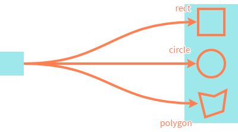](https://anseki.github.io/leader-line/)

#### <a name="attachments-areaanchor-x-y"></a>`x`, `y`

*Type:* number or string  
*Default:* `'-5%'`

An option for when `rect` or `circle` is specified for [`shape`](#shape) option.

The X and Y coordinates for the top-left corner of the area, in pixels, relative to the top-left corner of the specified element for [`element`](#attachments-areaanchor-element) option.  
Each value can be a percentage of the element's width or height. For example, `{x: '50%', y: '50%'}` indicates the center of the element, `{x: '100%', y: 0}` indicates the top-right corner.  
And also, each value can be a negative value or a value over the element's width or height, it indicates the outside of the element.

#### `width`, `height`

*Type:* number or string  
*Default:* `'110%'`

An option for when `rect` or `circle` is specified for [`shape`](#shape) option.

The width and height of the area, in pixels.  
Each value can be a percentage of the element's width or height. For example, `{x: '50%', y: 0, width: '50%', height: '100%'}` indicates the right half of the element.  
And also, each value can be a value over the element's width or height.

#### `radius`

*Type:* number  
*Default:* `0`

An option for when `rect` is specified for [`shape`](#shape) option.

The radius to round corners of the area, in pixels.

```js
new LeaderLine(startElement,
  LeaderLine.areaAnchor(endElement,
    {x: '20%', y: '20%', width: '60%', height: '60%', radius: 10}));
```

#### `points`

*Type:* Array  

An option for when `polygon` is specified for [`shape`](#shape) option.

An Array that contains three or more points of the polygon. Each item that is a point is an Array that contains the X and Y coordinates for the point. That is, it is Array that contains Array, like `[[x1, y1], [x2, y2], ...]`.  
The X and Y coordinates are handled as same as [`x` and `y`](#attachments-areaanchor-x-y) options.

```js
new LeaderLine(startElement,
  LeaderLine.areaAnchor(endElement,
    {shape: 'polygon', points: [[10, 15], ['90%', '70%'], [10, '80%']]}));
```

#### <a name="attachments-areaanchor-color"></a>`color`

*Type:* string  
*Default:* [`color`](#options-color) of current first attached leader line (synchronously)

A color (see [Color Value](#color-value)) of the border of the area.  
By default, a value of [`color`](#options-color) option of the first leader line in current attached leader lines is set synchronously (i.e. it is changed when `color` of the leader line was changed).

#### `fillColor`

*Type:* string  
*Default:* `''`

A fill-color (see [Color Value](#color-value)) of the area.  
If it is not specified (default), the area is not painted. It is better than specifying `'rgba(0, 0, 0, 0)'`.

```js
new LeaderLine(startElement,
  LeaderLine.areaAnchor(endElement,
    {x: 14, y: 20, width: 42, height: 60, radius: 10, fillColor: '#f8cd1e'}));
```

#### <a name="attachments-areaanchor-size"></a>`size`

*Type:* number  
*Default:* [`size`](#options-size) of current first attached leader line (synchronously)

The width of the border of the area, in pixels.  
If `0` is specified, the border is not drawn.

```js
new LeaderLine(startElement,
  LeaderLine.areaAnchor(endElement,
    {shape: 'polygon', points: [[10, 15], [63, 70], [10, 80]],
      fillColor: '#f8cd1e', size: 0}));
```

#### <a name="attachments-areaanchor-dash"></a>`dash`

*Type:* boolean or Object  
*Default:* `false`

Enable "dashed line" effect to the border of the area with specified Object that can have properties as the following options.  
Or `true` to enable it with all default options.

```js
new LeaderLine(startElement,
  LeaderLine.areaAnchor(endElement,
    {x: 14, y: 20, width: 42, height: 60, radius: 8, dash: true}));
```

##### `len`, `gap`

*Type:* number  
*Default:* `len`: [`size`](#attachments-areaanchor-size) * 2 (synchronously) | `gap`: `size` (synchronously)

The size of parts of the dashed line, in pixels.  
`len` is length of drawn lines, `gap` is gap between drawn lines.

### `mouseHoverAnchor`

```js
attachment = LeaderLine.mouseHoverAnchor(options)
```

Or

```js
attachment = LeaderLine.mouseHoverAnchor(element[, showEffectName][, options])
```

An attachment that is specified instead of an element for the [`start` or `end`](#start-end) option of the leader line, for showing and hiding the leader line by the mouse hovering.  
This is a convenient way to call [`show`](#show-hide) method when a mouse enters the element, and call [`hide`](#show-hide) method when a mouse leaves the element. Also, a small icon and some style are added to the element.  
And also, it includes a polyfill for `mouseenter` and `mouseleave` events that are not supported by some web browsers.

```js
new LeaderLine(LeaderLine.mouseHoverAnchor(startElement), endElement);
```

This is an attachment to provide a convenient way to do the behavior above. If you want more style or more custom behavior, you will use [`show`/`hide`](#show-hide) methods and your CSS code instead of this attachment.

The `options` argument is an Object that can have properties as options that are described later.

The `element` and `showEffectName` arguments are shortcuts to `options.element` and `options.showEffectName`. The following two codes work same.

```js
attachment1 = LeaderLine.mouseHoverAnchor({element: element1});
attachment2 = LeaderLine.mouseHoverAnchor({element: element2, style: {color: 'red'}});
attachment3 = LeaderLine.mouseHoverAnchor({element: element3, showEffectName: 'draw'});
attachment4 = LeaderLine.mouseHoverAnchor(
  {element: element4, showEffectName: 'draw', style: {color: 'red'}});
```

```js
attachment1 = LeaderLine.mouseHoverAnchor(element1);
attachment2 = LeaderLine.mouseHoverAnchor(element2, {style: {color: 'red'}});
attachment3 = LeaderLine.mouseHoverAnchor(element3, 'draw');
attachment4 = LeaderLine.mouseHoverAnchor(element4, 'draw', {style: {color: 'red'}});
```

This attachment can be shared between multiple leader lines. See [`pointAnchor`](#pointanchor) attachment for the sharing and the life cycle.

#### <a name="attachments-mousehoveranchor-element"></a>`element`

*Type:* HTML element

An element that is a trigger for showing and hiding the leader line.

#### `showEffectName`

*Type:* string  
*Default:* Value that was specified last time, or `fade` at first time

A value that is passed to [`show`/`hide`](#show-hide) methods as its `showEffectName` argument.

```js
new LeaderLine(LeaderLine.mouseHoverAnchor(startElement, 'draw'), endElement);
```

#### `animOptions`

*Type:* Object  
*Default:* See [`showEffectName`](#methods-show-hide-showeffectname) of [`show`/`hide`](#show-hide) methods

A value that is passed to [`show`/`hide`](#show-hide) methods as its `animOptions` argument.

#### `style`

*Type:* Object  
*Default:* `undefined`

An Object that has additional style properties for the element.  
You can specify `null` as a property to disable adding the style property. Note that it doesn't disable the style property. For example, if `{backgroundColor: null}` is specified, the attachment doesn't change current `backgroundColor` style property of the element.

#### `hoverStyle`

*Type:* Object  
*Default:* `undefined`

This works same to [`style`](#style) option except that these style properties are added when a mouse enters the element.

#### `onSwitch`

*Type:* function  
*Default:* `undefined`

A function that is called after [`show`/`hide`](#show-hide) method, with an `event` argument.

### `captionLabel`

```js
attachment = LeaderLine.captionLabel(options)
```

Or

```js
attachment = LeaderLine.captionLabel(text[, options])
```

An attachment that is specified instead of a string for the [`startLabel`, `middleLabel` or `endLabel`](#startlabel-middlelabel-endlabel) option of the leader line, for showing a custom label on the leader line.

```js
new LeaderLine(startElement, endElement, {
  startLabel: LeaderLine.captionLabel('START'),
  middleLabel: LeaderLine.captionLabel('MIDDLE'),
  endLabel: LeaderLine.captionLabel('END')
});
```

The `options` argument is an Object that can have properties as options that are described later.

The `text` argument is shortcut to `options.text`. The following two codes work same.

```js
attachment1 = LeaderLine.captionLabel({text: 'LABEL-1'});
attachment2 = LeaderLine.captionLabel({text: 'LABEL-2', color: 'red'});
```

```js
attachment1 = LeaderLine.captionLabel('LABEL-1');
attachment2 = LeaderLine.captionLabel('LABEL-2', {color: 'red'});
```

This attachment can *not* be shared between multiple leader lines.  
When the attachment that was already attached is attached to another leader line, then, the former leader line is detached automatically. That is, the attachment moves from the leader line to another leader line.

```js
// A new attachment instance is attached to `line1`.
line1.endLabel = LeaderLine.captionLabel('LABEL-1');

// The attachment is attached to `line2`, then, `line1` is detached.
line2.endLabel = line1.endLabel;
```

Also, it can move between labels of the same leader line.

```js
// The attachment is moved from `endLabel` to `startLabel`.
line1.startLabel = line1.endLabel;
```

When the leader line is detached from the attachment and any leader line is not attached, the attachment is removed from the web page automatically, and it can't be used anymore.

#### `text`

*Type:* string  

A string that is shown as a label.

#### `offset`

*Type:* Array  
*Default:* Calculated suitable position

By default, a `captionLabel` attachment that is attached as `startLabel` is positioned near the socket (i.e. connecting point) that is decided by [`startSocket`](#startsocket-endsocket) option of the leader line. In like manner, attached one as `endLabel` is positioned near the socket that is decided by `endSocket` option. Those are calculated with the size of the leader line, the font size of the label, etc.

If an Array that is `[x, y]` in pixels is specified for `offset` option, the attachment is positioned at the specified coordinates relative to the decided socket.

```js
new LeaderLine(startElement, endElement, {
  startLabel: LeaderLine.captionLabel('START', {color: 'blue', offset: [-20, 0]})
});
```

#### <a name="attachments-captionlabel-lineoffset"></a>`lineOffset`

*Type:* number  
*Default:* `0`

By default, a `captionLabel` attachment that is attached as `middleLabel` is positioned at the middle point of the path of the leader line.  
If a length in pixels is specified for `lineOffset` option, the attachment is positioned at the offset point from the middle point of the path. The length is distance along the path, a negative value makes it become close to the element as [`start`](#start-end) option.

#### `color`

*Type:* string  
*Default:* [`color`](#options-color) of current attached leader line (synchronously)

A color (see [Color Value](#color-value)) of the text.  
By default, a value of [`color`](#options-color) option of the current attached leader line is set synchronously (i.e. it is changed when `color` of the leader line was changed).

#### <a name="attachments-captionlabel-outlinecolor"></a>`outlineColor`

*Type:* string  
*Default:* `'#fff'`

A color (see [Color Value](#color-value)) of an outline of the text.  
The outline makes the text avoid seeming to blend with a background.  
If `''` is specified, the outline is not drawn. It is better than specifying `'rgba(0, 0, 0, 0)'`.

#### <a name="attachments-captionlabel-other-style-properties"></a>Other Style Properties

You can specify the following CSS properties also:

- `fontFamily`
- `fontStyle`
- `fontVariant`
- `fontWeight`
- `fontStretch`
- `fontSize`
- `fontSizeAdjust`
- `kerning`
- `letterSpacing`
- `wordSpacing`
- `textDecoration`

Note that some properties might not be supported by some web browsers, LeaderLine doesn't care for those.

### `pathLabel`

```js
attachment = LeaderLine.pathLabel(options)
```

Or

```js
attachment = LeaderLine.pathLabel(text[, options])
```

An attachment that is specified instead of a string for the [`startLabel`, `middleLabel` or `endLabel`](#startlabel-middlelabel-endlabel) option of the leader line, for showing a label along the path of the leader line.

```js
new LeaderLine(startElement, endElement, {
  startLabel: LeaderLine.pathLabel('START'),
  middleLabel: LeaderLine.pathLabel('MIDDLE'),
  endLabel: LeaderLine.pathLabel('END')
});
```

The `options` argument is an Object that can have properties as options that are described later.

The `text` argument is shortcut to `options.text`. The following two codes work same.

```js
attachment1 = LeaderLine.pathLabel({text: 'LABEL-1'});
attachment2 = LeaderLine.pathLabel({text: 'LABEL-2', color: 'red'});
```

```js
attachment1 = LeaderLine.pathLabel('LABEL-1');
attachment2 = LeaderLine.pathLabel('LABEL-2', {color: 'red'});
```

This attachment can *not* be shared between multiple leader lines. See [`captionLabel`](#captionlabel) attachment for the sharing and the life cycle.

Note that the characters are put along the path of the leader line from the [`start`](#start-end) element toward the [`end`](#start-end) element even if the path curves sharply or it is drawn toward the left. If you have to avoid those cases for important text, use [`captionLabel`](#captionlabel) instead.

#### `text`

*Type:* string  

A string that is shown as a label.

#### <a name="attachments-pathlabel-lineoffset"></a>`lineOffset`

*Type:* number  
*Default:* `0`

By default, a `pathLabel` attachment that is attached as `startLabel` is positioned near the element as [`start`](#start-end) option. In like manner, attached one as `endLabel` is positioned near the element as `end` option. And attached one as `middleLabel` is positioned at the middle point of the path of the leader line.  
If a length in pixels is specified for `lineOffset` option, the attachment is positioned at the offset point from the position above. The length is distance along the path, a negative value makes it become close to the element as `start` option.

#### `color`

*Type:* string  
*Default:* [`color`](#options-color) of current attached leader line (synchronously)

A color (see [Color Value](#color-value)) of the text.  
By default, a value of [`color`](#options-color) option of the current attached leader line is set synchronously (i.e. it is changed when `color` of the leader line was changed).

#### <a name="attachments-pathlabel-outlinecolor"></a>`outlineColor`

*Type:* string  
*Default:* `'#fff'`

A color (see [Color Value](#color-value)) of an outline of the text.  
The outline makes the text avoid seeming to blend with a background.  
If `''` is specified, the outline is not drawn. It is better than specifying `'rgba(0, 0, 0, 0)'`.

#### Other Style Properties

See the [option of `captionLabel`](#attachments-captionlabel-other-style-properties).

## Animation Options

### `duration`

*Type:* number

A number determining how long (milliseconds) the animation will run.

```js
new LeaderLine(
  LeaderLine.mouseHoverAnchor(startElement, 'draw', {
    animOptions: {
      duration: 3000
    }
  }),
  endElement
);
```

### `timing`

*Type:* Array or string

An Array that is `[x1, y1, x2, y2]` as a "timing function" that indicates how to change the speed. It works same as that of [CSS animation](https://developer.mozilla.org/en/docs/Web/CSS/timing-function).

```js
new LeaderLine(
  LeaderLine.mouseHoverAnchor(startElement, 'draw', {
    animOptions: {
      duration: 3000,
      timing: [0.5, 0, 1, 0.42]
    }
  }),
  endElement
);
```

You can specify one of the following keywords also. These values mean [keywords for common timing functions](https://developer.mozilla.org/en/docs/Web/CSS/timing-function#Keywords_for_common_timing-functions).

- `ease`
- `linear`
- `ease-in`
- `ease-out`
- `ease-in-out`

## Color Value

CSS color notations are accepted. A value might contain an alpha channel that specifies the transparency.  
For example, `hsl(200, 70%, 58%)`, `rgba(73, 172, 223, 0.5)`, `#49acdf`, `skyblue`, etc. Some web browsers support `hwb()`, `device-cmyk()` and `gray()` also.

---

Thanks for images: [Brain & Storm](http://brainandstorm.com/), [Michael Gaida](https://pixabay.com/users/MichaelGaida-652234/), [CGvector](http://www.cgvector.com/)
